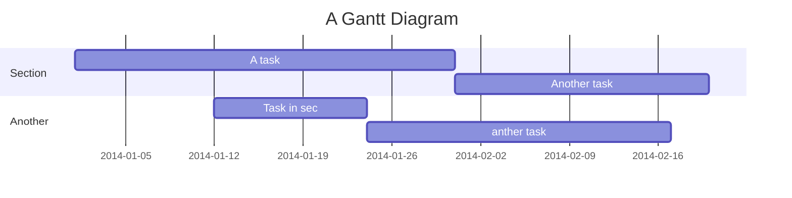

Bioinformatics 108-2 Course
===


[TOC]

## Outline

* Each topic includes:
    * Implement a simple algorithm in python.
    * Use tools to analyze **target gene**.

* Try analyzing one gene from different aspects using tools from each topic.


* Midterm: finish **target gene** analysis up to course progress.
* Final exam: analyze another gene as student wish.


---

## Topics

### Introduction to Basics
* Python introduction (pre-release notebooks and some exercises): 
    * Data structure
    * Pandas
    * Matplotlib (optional)
* 3 hr hands-on tutorial workshop for setting up environments for bioinformatic tools:
    * [Linux bash](https://drive.google.com/open?id=1ObxM1i47v_WZ9_MYnnhlFAUnPKxwNaeA)
    * [Docker](https://drive.google.com/open?id=1FmoAjYoYx1w7IrUtHORrn9BaXUySrrRr)

- [ ] Prepare one image including:
    * Tools 
    * Optional: Python3, R, (jupyterlab)


### Sequence alignment
> Given unknown sequence, what is it ? Is it a gene ?
* Implementation: Pairwise alignment
    * Given two strings, return the best alignment.
* Tool: BLAST, Bedtools


### Phylogeny and Evolution
> Given this sequence, what is the similar sequence in other organism?
* Implementation: UPGMA clustering
* Tool: http://www.clustal.org/omega/


### Midterm


### RNA-sequencing & Gene Expression
> What is the expression of this gene? Does it differentially expressed in cancers?
* Lecture: 
    * NGS: RNA-seq
    * Differential Expression
    * Gene Ontology over-representation analysis
* Implementation: 
    * simple t-test to find DEG (using scipy)
    * Gene Ontology over-representation analysis 
* Tool: STAR pipeline to get reads count.


### Network Biology
> In cancer samples, what other genes co-expressed with this gene?
* Implementation: 
    * Construct Gene co-expression network and calculate network properties.
* Tool: Cytoscape


### Proteomics & Protein Structure
> What is this gene product will be? What is this protein’s structure?

* Implementation: 

* Tool: 


User flows
---
```sequence
Alice->Bob: Hello Bob, how are you?
Note right of Bob: Bob thinks
Bob-->Alice: I am good thanks!
Note left of Alice: Alice responds
Alice->Bob: Where have you been?
```

> Read more about sequence-diagrams here: http://bramp.github.io/js-sequence-diagrams/

Project Timeline
---


> Read more about mermaid here: http://knsv.github.io/mermaid/


```gherkin=
Feature: Guess the word

  # The first example has two steps
  Scenario: Maker starts a game
    When the Maker starts a game
    Then the Maker waits for a Breaker to join

  # The second example has three steps
  Scenario: Breaker joins a game
    Given the Maker has started a game with the word "silky"
    When the Breaker joins the Maker's game
    Then the Breaker must guess a word with 5 characters
```
> I choose a lazy person to do a hard job. Because a lazy person will find an easy way to do it. [name=Bill Gates]


> Read more about Gherkin here: https://docs.cucumber.io/gherkin/reference/
## Appendix and FAQ

:::info
**Find this document incomplete?** Leave a comment!
:::

###### tags: `bioinformatics` `course material`
