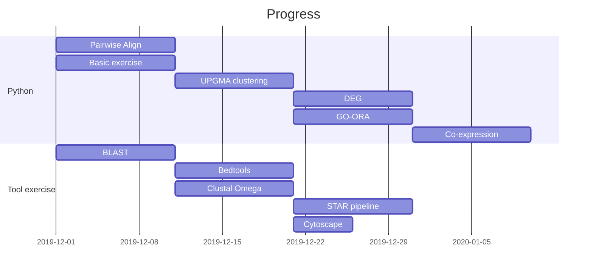

Introduction to Bioinformatics
===

[TOC]

## Outline

* Each topic includes:
    * Implement a simple algorithm in python.
    * Use tools to analyze **target gene** and discuss the results.

* Try analyzing one gene from different aspects using tools from each topic.


* Midterm: finish **target gene** analysis up to course progress.
* Final exam: analyze another gene as student wish or selected from a list.


## Target Gene?

---

## Topics

### Introduction to Basics
* Python introduction: 
    * [Data structure](https://haochunchang.github.io/images/pandas/Python3_data_structure.html)
    * [Pandas & Matplotlib](https://haochunchang.github.io/images/pandas/Pandas_Matplotlib.html)
    * Exercises:
* Setting up environments for bioinformatic tools:
    * [Docker](https://drive.google.com/open?id=1FmoAjYoYx1w7IrUtHORrn9BaXUySrrRr): we use this [docker image](https://cloud.docker.com/u/jr55662003/repository/docker/jr55662003/bioinformatic-course)
    ```bash
    docker run -it \ # enable interactive shell
               -p 7777:8888 \ # host-port:container-port
               -v ~/course:/course \ # mount data folders from host
               --name="course" \
               --hostname="bioinformatic-course" \ # optional
               jr55662003/bioinformatic-course:v1 bash
    ```
    * [Linux bash](https://drive.google.com/open?id=1ObxM1i47v_WZ9_MYnnhlFAUnPKxwNaeA)
    ```bash
    docker attach bioinformatic-course
    mkdir course
    cd course
    jupyter lab --allow-root --ip=0.0.0.0
    ```
    * Todo: video of 3 hr hands-on workshop


### Sequence alignment
> Given unknown sequence, what is it ?

* Implementation: Pairwise alignment
    * Given two strings, return the best alignment.
* Tool: 
    * BLAST: [Tutorial](https://open.oregonstate.education/computationalbiology/chapter/command-line-blast/)
    * Bedtools: [Documentation](https://bedtools.readthedocs.io/en/latest/)


### Phylogeny and Evolution
> Given this sequence, what is the similar sequence in other organism?
* Implementation: UPGMA clustering
* Tool: ClustalOmega(```clustalo```)

---
### Midterm
* BLAST, Bedtools and ClustalOmega exercise
* Explain and implement Pairwise alignment and UPGMA clustering.

---
### RNA-sequencing & Gene Expression
> What is the expression of this gene? 
> 
> Does it differentially expressed in cancers?
* Lecture: 
    * NGS: RNA-seq
    * Differential Expression
    * Gene Ontology over-representation analysis
* Implementation: 
    * simple t-test to find DEG (using scipy)
    * Gene Ontology over-representation analysis 
* Tool: 
    * STAR pipeline to get reads count.
    * [Documentation](https://github.com/alexdobin/STAR/blob/master/doc/STARmanual.pdf)
    * [Tutorial](https://hbctraining.github.io/Intro-to-rnaseq-hpc-O2/lessons/03_alignment.html)

### Network Biology
> In cancer samples, what other genes co-expressed with this gene?
* Implementation: 
    * Construct Gene co-expression network and calculate network properties.
* Tool: Cytoscape


### Proteomics & Protein Structure
> What is this gene product will be? What is this protein’s structure?

* Implementation: 

* Tool: 

---
### Final Exam
* Choose a gene to analyze using tools or implement algorithms.
* 25% per topics. (BLAST, Clustal, DEG, Cytoscape)
* +5% per implementation of algorithm.
---

Preparation Timeline
---


## Appendix and FAQ


---
:::info
**Welcome any feedback!** Please leave a comment!
:::

###### tags: `course material` `bioinformatics` 
